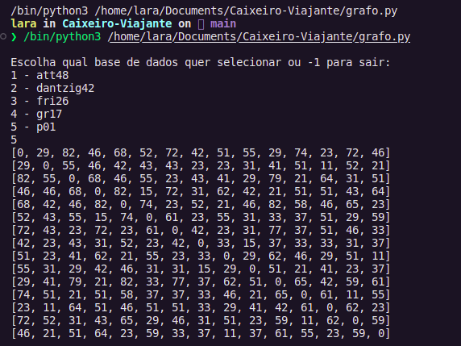

# Problema do Caixeiro Viajante

## Descrição
Esse projeto se trata de um trabalho para a disciplina de Teoria dos Grafos na Universidade Federal de Alagoas (UFAL), Campus Arapiraca. Ele se trata do Problema do Caixeiro Viajante, cujo objetivo principal é descobrir o caminho mais curto que visita cada cidade exatamente uma vez, retornando à cidade de origem. A abordagem adotada utiliza a Teoria dos Grafos, onde as cidades são representadas por vértices e as conexões entre elas são expressas por arestas.

Serão utilizadas cinco base de dados (ATT48, DANTZIG42, FRI26, GR17 e P01) para a resolução desse problema, disponíveis através do [link](https://people.sc.fsu.edu/~jburkardt/datasets/tsp/tsp.html).

Os dados utilizados dos datasets estão em um formato de matriz de adjacência (arquivos .d.txt), que correspondem às distâncias intermunicipais. Isso tornou possível simplesmente armazená-los em uma matriz. Isso porque, ela proporciona uma manipulação mais eficiente do grafo, facilitando as operações necessárias para abordar o PCV.

Posteriormente serão implementados algoritmos para encontrar os caminhos mínimos para cada uma da base de dados.

## Como usar

Antes de utilizar o projeto, é necessário baixar os arquivos para o seu computador. Assim, isso pode ser feito de 2 maneiras:

-> <b>Pelo próprio GitHub</b>

Você vai clicar no botão verde <b><>Code</b> e ao fazer isso aparecerá as seguintes informações:


Ao clicar em Download ZIP, você terá os arquivos no formato zip em seu computador. Dessa forma, basta fazer a extração da pasta e terá o projeto completo na sua máquina.

-> <b>Terminal</b>

Outra forma bastante rápida de obter os arquivos do projeto, através de um simples comando:

```
$ git clone https://github.com/evellyn489/Caixeiro-Viajante.git
```
Isso tanto para sistemas Windows como para sistemas Linux.

Assim, feito esse passo faleremos em seguida como utilizar o projeto.

<b>Obs</b>: essa parte será mostrada no VsCode, além disso, é necessário ter o <a href="https://www.python.org/" target="_blank">Python</a> instalado na máquina para poder executar o código baixado.

Caso você tenha o Python já instalado, pode seguir as próximas instruções abaixo:

1. Abra o VsCode e em seguida a pasta que contém o projeto
2. Em seguida, vai procurar o arquivo grafo.py
3. E logo abaixo do código terá uma variável chamada <b>name_file</b> em que você vai digitar o nome do arquivo que se encontra na pasta <b>datasets</b>



4. E depois só executar o código e terá o seguinte resultado:


## Licença
A licença do projeto é MIT (Massachusetts Institute of Technology) , o que significa que os usuários têm a liberdade de usar, modificar e distribuir o código-fonte conforme suas necessidades. 

## Contato dos desenvolvedores

- Evellyn Rodrigues: evellyn.rocha@arapiraca.ufal.br
- Kauã Fellipe: kaua.bispo@arapiraca.ufal.br
- Lara Fernanda: lara.cavalcante@arapiraca.ufal.br

## Hardware sugerido
Por enquanto, não há uma sugestão específica de hardware, tendo em vista que os dados foram apenas armazenados. Para a aplicação do projeto, até o momento, foram utilizados 3 tipos de hardware:

- Processador Intel Core i5 - 1135G7, 8GB de RAM, SSD de 256 GB e sistema operacional Windows.
- Processador 2.300GHz Intel Core i3, 4GB de RAM, HD de 1 TB e sistema operacional Linux

## Software necessário

Todo o projeto está rodando em sistemas Linux e Windows.
